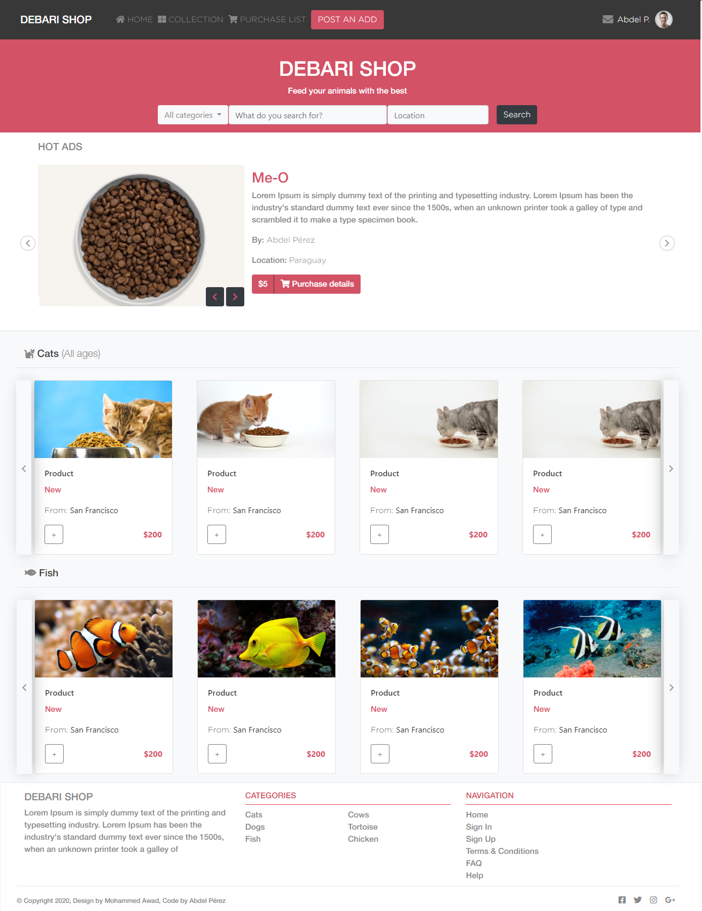

# Animals Food Ecommerce

> This is the Captstone Project for the Microverse CSS and HTML curriculum. The objective of this project is to create a website using the design idea provided here with whatever content you desire.

## Built With

- HTML5, CSS.
- Bootstrap 4.4.1

## Live Demo

[Live Demo Link](https://rawcdn.githack.com/abdelp/html-capstone/27772be1923b0b63c8660eb7dfd35f8ab1a14b23/index.html)

## Author

👤 **Abdel Pérez**

- Github: [@abdelp](https://github.com/abdelp/)
- Twitter: [@AbdelPerez11](https://twitter.com/abdelperez11)
- Linkedin: [Abdel Pérez](https://www.linkedin.com/in/abdel-p%C3%A9rez-t%C3%A9llez-72b2aa153/)

## 🤝 Contributing

Contributions, issues and feature requests are welcome!

Feel free to check the [issues page](https://github.com/abdelp/using-bootstrap/issues).

## Show your support

Give a ⭐️ if you like this project!

## Credits

All credits for the design goes to [Mohammed Awad](https://www.behance.net/M_Awad)
